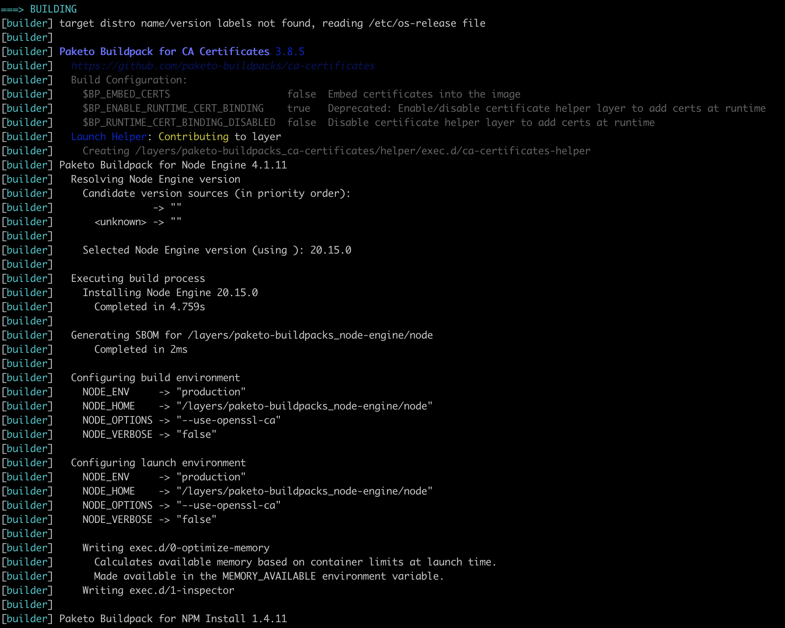

# Unified Log Output For All Paketo Buildpacks

## Summary

There are 2 different ways logging is done in the buildpacks:

* buildpacks based on `packit/v2` seem to use `packit/v2/scribe`
* buildpacks based on `libpak` seem to use `libpak/bard`  

Unfortunately, this results is log output that looks different because of the use of colors and different styles `libpak/bard`. `packit/v2/scribe` is simpler and only uses plain text.

## Motivation

I think it would be beneficial if paketo buildpacks have a unified Look&Feel. This is excpecially true for meta buildpacks that include both "types" of buildpacks (e.g. `nodejs`).

Or use [npm sample](https://github.com/paketo-buildpacks/samples/tree/main/nodejs/npm) to see the different log outputs.

The logger from `libpak` uses color so that it quite clear where the logging for a new buildpack starts. But when combined with the text-only logging from `packit`, is is kind of confusing.

## Detailed Explanation

All buildpacks would use the same logger.

## Rationale and Alternatives

* Keep it like it is.

* Change one of the loggers to match the output of the other.

* All buildpacks use `libpak/bard`

## Implementation

This could either be done by having all buildpacks to change to a specific logger (preferrable `libpak/bard` since the output is nicer). Or by creating a common library including logging (based on `libpak/bard`) and adapt this library with all buildpacks.

This common library could then could then even contain more things both approaches (`libpak` and `packit`) have in common. 

## Prior Art

## Unresolved Questions and Bikeshedding
